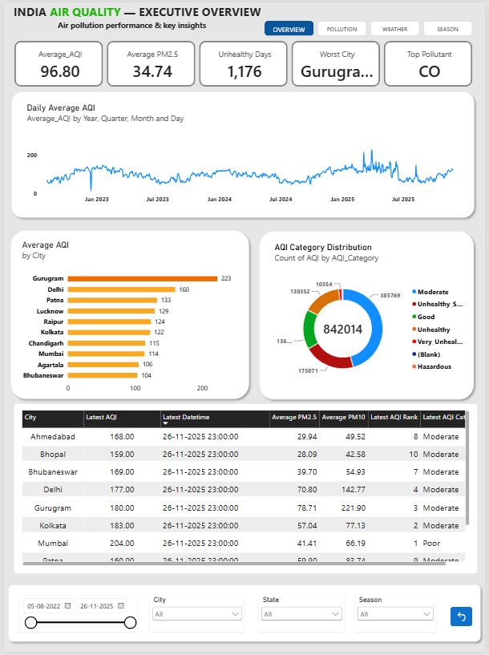
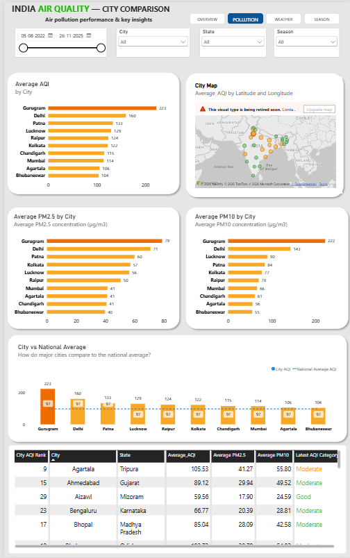
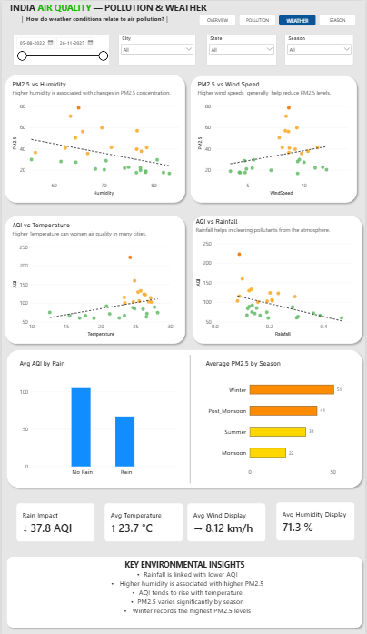
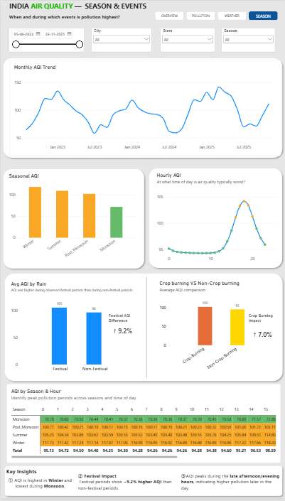

# 🇮🇳 India Urban Air Quality Analytics

### End-to-End Data Analytics & Business Intelligence Project

An end-to-end data analytics project analyzing **858K+ hourly air-quality observations across Indian cities** to identify pollution hotspots, temporal patterns, pollutant behavior, seasonal effects, and environmental factors associated with poor air quality.

The project demonstrates a complete analytics workflow using **Excel, SQL Server, Power BI, DAX, and data visualization**.

---

## 📊 Power BI Dashboard

The project includes an interactive Power BI dashboard designed to analyze
urban air quality across Indian cities through four analytical perspectives.

---

### 01 — Executive Overview

Provides a high-level summary of air-quality conditions, including overall AQI,
pollution levels, city rankings, and major pollution indicators.

  

---

### 02 — City Comparison

Compares air-quality performance across Indian cities using AQI, PM2.5,
PM10, city rankings, and geographic distribution.

  

---

### 03 — Pollution & Weather

Examines relationships between air pollution and environmental conditions
such as temperature, humidity, wind speed, and rainfall.

  

---

### 04 — Season & Events

Analyzes seasonal and event-based pollution patterns, including monthly AQI,
hourly AQI, festival periods, crop burning, and temperature inversion.

  

## 🎯 Project Objective

The primary objective of this project is to analyze urban air-quality data across India and answer important analytical questions such as:

- Which cities experience the highest pollution levels?
- Which pollutants contribute most to poor AQI?
- How does AQI change over time?
- What are the worst and best performing cities?
- Which months and seasons have the highest pollution?
- How do weather conditions affect air quality?
- Is pollution different during festivals?
- How does crop burning relate to AQI?
- How does temperature inversion relate to pollution?
- What pollution patterns can be identified at hourly, daily, monthly, and seasonal levels?

The ultimate goal is to transform raw air-quality observations into **actionable environmental insights through an interactive BI dashboard**.

---

---

---

---

## 🔄 Project Workflow

The project follows a structured end-to-end analytics workflow:

| Step | Stage | Description |
|---|---|---|
| **01** | 📂 **Raw Dataset** | Collect and understand the raw air-quality data |
| **02** | 🧹 **Data Cleaning & Validation** | Handle missing values, duplicates, data types, and inconsistencies |
| **03** | 🗄️ **SQL Server — Data Preparation** | Store, transform, validate, and query the cleaned data |
| **04** | 📊 **Exploratory Data Analysis** | Identify trends, patterns, pollution hotspots, and relationships |
| **05** | 🧮 **DAX & Analytical Measures** | Create KPIs and dynamic analytical calculations |
| **06** | 📈 **Power BI Dashboard** | Build interactive visualizations and analytical reports |
| **07** | 💡 **Insights & Reporting** | Convert analysis into meaningful environmental insights |

---

## 📬 Contact

### Mohit Mehta

**Data Analyst | Business Intelligence | SQL | Power BI**

I'm interested in opportunities and collaborations in **Data Analytics, Business Intelligence, SQL, and Power BI**.

- 💼 **LinkedIn:** [Connect with me](https://www.linkedin.com/in/mohit-mehta-726179307/)
- 💻 **GitHub:** [View my profile](https://github.com/Dynamatic01)
- 📧 **Email:** [Contact me](mohitmehta514@gmil.com)

---

  ⭐ If you found this project useful, consider giving the repository a star.

